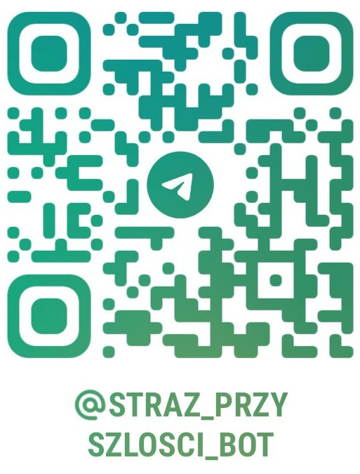

# Runbook uruchomienia kanału Telegram -> GitHub Issues

## Cel

Ten runbook pokazuje, jak szybko uruchomić bota Telegram, do którego ludzie będą wysyłać:

- `Pomysl: ...`
- `Uwaga: ...`

Wiadomości trafią do repozytorium Straży Przyszłości jako `GitHub Issues`.

## Publiczny bot inicjatywy

Kanał publiczny działa już pod nazwą **Straż Przyszłości**:

- [`@straz_przyszlosci_bot`](https://t.me/straz_przyszlosci_bot)



To jest najprostsza ścieżka dla nowych osób, które chcą z telefonu szybko zapisać myśl do repozytorium.

Jak się połączyć:

1. Otwórz Telegram.
2. Wyszukaj `@straz_przyszlosci_bot`.
3. Otwórz czat z botem `Straż Przyszłości`.
4. Wyślij wiadomość w jednym z dwóch formatów:

```text
Pomysl: ...
Uwaga: ...
```

Co robi bot:

- tworzy `GitHub Issue` w publicznym repo Straży Przyszłości,
- pozwala szybko zgłaszać pomysły, uwagi i ryzyka z telefonu,
- odpisuje krótko, czy zgłoszenie zostało przyjęte, odrzucone przez filtr antyspamowy albo wymaga poprawnego prefiksu,
- nie służy do wysyłania danych providerskich ani do sterowania urządzeniami.

## Dlaczego to jest prostsze niż WhatsApp

Na etapie `v1` bot Telegram jest zwykle prostszy do uruchomienia niż biznesowy kanał Meta, ponieważ:

- tworzysz go bezpośrednio przez `@BotFather`,
- dostajesz token od razu,
- webhook ustawiasz jedną komendą `setWebhook`,
- nie potrzebujesz cięższego onboardingu biznesowego.

## Oficjalne źródła Telegram

- Bot API: https://core.telegram.org/bots/api
- Tutorial: https://core.telegram.org/bots/tutorial
- Bots FAQ: https://core.telegram.org/bots/faq

## Co już jest gotowe w repo

- [`cloudflare/src/telegram_issues.js`](../cloudflare/src/telegram_issues.js)
- [`cloudflare/src/worker.js`](../cloudflare/src/worker.js)
- [`cloudflare/wrangler.toml`](../cloudflare/wrangler.toml)
- [`cloudflare/telegram_issue_smoke_test.py`](../cloudflare/telegram_issue_smoke_test.py)
- [`docs/ARCHITEKTURA_MOSTU_TELEGRAM_GITHUB_ISSUES.md`](ARCHITEKTURA_MOSTU_TELEGRAM_GITHUB_ISSUES.md)

## Krok 1. Utwórz bota przez `@BotFather`

1. Otwórz Telegram.
2. Wyszukaj `@BotFather`.
3. Wyślij komendę:

```text
/newbot
```

4. Podaj:
   - nazwę bota, np. `Straż Przyszłości`
   - username kończący się na `bot`, np. `straz_przyszlosci_bot`
5. Zapisz token bota zwrócony przez `@BotFather`.

To będzie Twój:

```text
TELEGRAM_BOT_TOKEN
```

## Krok 2. Wdróż Worker'a

1. Uzupełnij `database_id` i `preview_database_id` w [`cloudflare/wrangler.toml`](../cloudflare/wrangler.toml).
2. Wgraj sekret GitHub:

```bash
npx wrangler secret put GITHUB_TOKEN
```

3. Ustaw zmienne środowiskowe dla Telegrama.

Minimalny bezpieczny wariant:

```text
TELEGRAM_ISSUES_ENABLED = "true"
TELEGRAM_ISSUES_DRY_RUN = "true"
TELEGRAM_ALLOWED_CHAT_IDS = "<twoj-chat-id-testowy>"
TELEGRAM_MIN_INTERVAL_SECONDS = "60"
TELEGRAM_WEBHOOK_SECRET_TOKEN = "<losowy-sekret>"
TELEGRAM_WEBHOOK_PATH_SEGMENT = "<drugi-losowy-segment>"
```

4. Wdróż:

```bash
npx wrangler deploy
```

## Krok 3. Ustal URL webhooka

Jeżeli używasz sekretnej ścieżki, webhook powinien wyglądać tak:

```text
https://<twoj-worker>.workers.dev/integrations/telegram/webhook/<TELEGRAM_WEBHOOK_PATH_SEGMENT>
```

Jeżeli nie używasz sekretnej ścieżki:

```text
https://<twoj-worker>.workers.dev/integrations/telegram/webhook
```

Rekomenduję wariant z sekretną ścieżką.

## Krok 4. Ustaw webhook w Telegramie

Według oficjalnego `Bot API` webhook ustawia się metodą `setWebhook`.

Przykład:

```bash
curl "https://api.telegram.org/bot<TELEGRAM_BOT_TOKEN>/setWebhook" \
  -H "Content-Type: application/json" \
  -d '{
    "url": "https://<twoj-worker>.workers.dev/integrations/telegram/webhook/<TELEGRAM_WEBHOOK_PATH_SEGMENT>",
    "secret_token": "<TELEGRAM_WEBHOOK_SECRET_TOKEN>",
    "drop_pending_updates": true,
    "allowed_updates": ["message", "edited_message"]
  }'
```

To jest rekomendowana konfiguracja `v1`.

## Krok 5. Jak zdobyć `chat_id`

Najprostsza droga:

1. uruchom bota,
2. napisz do niego dowolną wiadomość,
3. uruchom smoke test albo krótki log webhooka,
4. odczytaj `chat.id` z przychodzącego `Update`.

Na początek możesz używać tylko własnego `chat_id` w allowliście.
Jeżeli chcesz kanał otwarty dla wszystkich, zostaw `TELEGRAM_ALLOWED_CHAT_IDS = "*"` i oprzyj ochronę na `TELEGRAM_MIN_INTERVAL_SECONDS` oraz sekrecie webhooka.

## Krok 6. Przetestuj webhook w `dry-run`

Najpierw zostaw:

```text
TELEGRAM_ISSUES_DRY_RUN = "true"
```

Potem wyślij do bota:

```text
Pomysl: zróbmy prosty panel porównujący przypadki z różnych projektów
```

albo:

```text
Uwaga: onboarding nowej osoby jest jeszcze za mało jednoznaczny
```

Możesz też zrobić kontrolowany test skryptem:

```bash
python3 cloudflare/telegram_issue_smoke_test.py \
  https://<twoj-worker>.workers.dev \
  --chat-id 500100200 \
  --message "Pomysl: test webhooka Telegram do Issues" \
  --secret-token "<TELEGRAM_WEBHOOK_SECRET_TOKEN>" \
  --path-segment "<TELEGRAM_WEBHOOK_PATH_SEGMENT>"
```

## Krok 7. Włącz realne tworzenie Issues

Gdy `dry-run` działa:

1. ustaw:

```text
TELEGRAM_ISSUES_DRY_RUN = "false"
```

2. nadal trzymaj krótką allowlistę `chat_id`,
3. wykonaj jeden test z prawdziwym issue,
4. dopiero potem otwórz kanał szerzej.

## Jak ludzie mają pisać do bota

Na stronie i w materiałach komunikacyjnych pokazuj tylko dwa wzorce:

```text
Pomysl: ...
Uwaga: ...
```

To ma być lekki kanał przechwytywania wartościowych myśli, a nie rozbudowany system supportowy.
Treść issue jest celowo krótka: tytuł, wiadomość i podstawowy ślad źródłowy.

## Minimalna polityka operatorska

Na start rekomenduję:

- tylko krótkie odpowiedzi potwierdzające przyjęcie, odrzucenie przez throttling albo zły format,
- brak danych providerów przez bota,
- tylko `Issues`,
- tylko tekst,
- tylko krótkie prefiksy,
- throttling jednego czatu/użytkownika przez `TELEGRAM_MIN_INTERVAL_SECONDS`,
- otwarty kanał `*` albo mała grupa testowa, zależnie od etapu.
